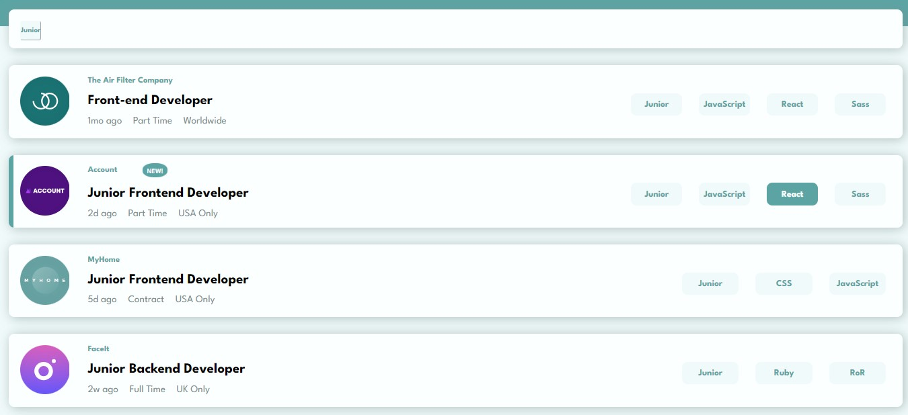

# Job listings with filtering solution

This is a solution to the [Job listings with filtering challenge on Frontend Mentor](https://www.frontendmentor.io/challenges/job-listings-with-filtering-ivstIPCt). Frontend Mentor challenges help you improve your coding skills by building realistic projects. 
### The challenge

Users should be able to:
- View the optimal layout for the site depending on their device's screen size
- See hover states for all interactive elements on the page
- Filter job listings based on the categories

### Links

- Solution URL: https://esnima.github.io/static-job-listing/

### Screenshot

## My process

### Built with

- React.js + context API
- SASS
- Flexbox
- CSS Grid
- Mobile-first workflow
- 
### What I learned
I had lots of problems with rendering my SVG files. I found out that gh-pages treats the public folder as the root of the project. 
I used context API to manage my states better.

## Author
Nima Mahmoodian
- LinkedIn:  www.linkedin.com/in/nima-mahmoodian
